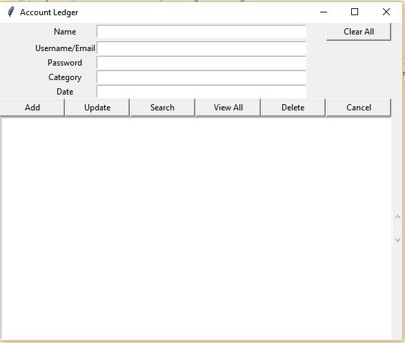
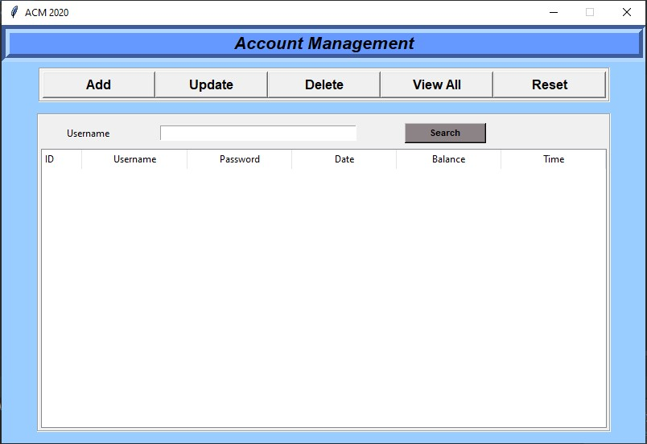

# Account Management (ACM)
This project is based on source code available from Github. It is further developed and completed according to the requirements of the Project Management subject given by lecturer Tran Son Hai.

Link source Github: https://github.com/Martialhimanshu/Account-management-system/blob/master/README.md

ACM application helps cyber gaming, coffee net to save and manage accounts. The application has basic features such as add, delete, update, search, view all accounts. The application uses SQLite and Python language.

| Old interface  | New interface |
| ------------- | ------------- |
|   |   |